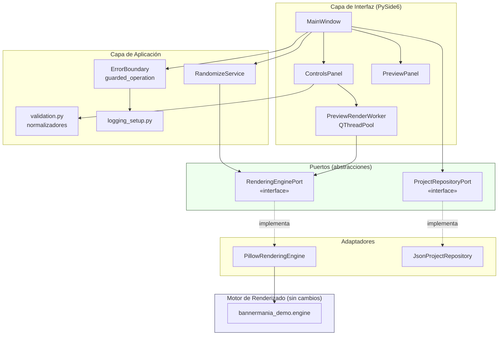
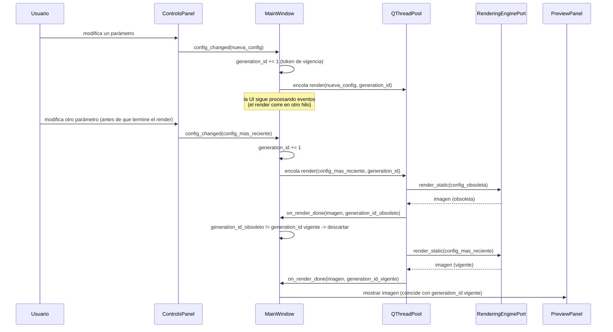

# Documento de Diseño

## Overview

BannerMania Desktop es una aplicación nativa de escritorio que reutiliza,
sin cambios de comportamiento, el Motor_de_Renderizado basado en Pillow que
hoy vive dentro de `app.py` (funciones `render_banner`, `render_scroll_gif`,
`paint_background`, `draw_border`, `draw_text_effect`, `hex_to_rgb`, y los
catálogos `FONT_CANDIDATES`, `EFFECTS`, `PATTERNS`, `BORDERS`, `MOTIONS`).
La app web actual (Flask) seguirá existiendo, pero el motor se extrae a un
módulo independiente sin dependencias de Flask ni de red, del que ambas
interfaces (web y escritorio) dependerán por igual.

La app de escritorio abre una ventana nativa, renderiza en el mismo proceso
(sin servidor HTTP, sin navegador), ofrece vista previa en tiempo real sin
bloquear la interfaz, exporta PNG/GIF al sistema de archivos local, permite
guardar/abrir un Archivo_de_Proyecto en JSON, y se distribuye como
instalador/ejecutable independiente para Windows, macOS y Linux.

### Decisiones de diseño para las preguntas abiertas de requirements.md

Estas cuatro preguntas quedaban abiertas en `requirements.md`. Se resuelven
aquí con una justificación explícita, ya que requirements.md indica que
deben resolverse "antes o durante el diseño".

**1. Sistemas operativos objetivo.** Se confirma el alcance de
Windows, macOS y Linux para la v1, tal como asumen los 13 requisitos
(ninguno excluye una plataforma). Nota técnica relevante para Req 2.4/2.5:
`FONT_CANDIDATES` en `app.py` hoy solo contiene rutas de macOS y de Linux
(`msttcorefonts`); no contiene rutas de Windows (`C:\Windows\Fonts\...`).
Esto **no** requiere cambiar la lógica del motor (que ya contempla el caso
"ninguna ruta existe" cayendo a la fuente de reemplazo integrada, Req 2.5),
pero sí se recomienda extender `FONT_CANDIDATES` con rutas de Windows como
una extensión de catálogo puramente de datos (Open/Closed: se agregan
entradas, no se modifica `resolve_font_path`/`load_font`), para que Windows
no dependa siempre de la fuente de reemplazo por defecto.

**2. Archivo de Proyecto (Requisito 10).** Se incluye en la v1. El
documento de requisitos ya lo especifica como Requisito 10 completo, con
criterios de aceptación de guardado, apertura, ida y vuelta y manejo de
errores — no aparece como opcional condicionado dentro del propio
documento, así que diseño lo trata como alcance comprometido de la v1 en
lugar de diferirlo.

**3. Firma de código y notarización.** Se omite en la v1. Es un proyecto de
demostración sin presupuesto de certificado de firma; firmar código en
Windows (Authenticode) y notarizar en macOS requiere certificados pagos y
un flujo de notarización con Apple que no aporta valor a una demo. Se
documenta como limitación conocida: en Windows, SmartScreen puede mostrar
una advertencia de "editor desconocido"; en macOS, Gatekeeper bloqueará el
primer inicio hasta que el usuario permita la app explícitamente (clic
derecho → Abrir). El Requisito 13 no exige firma; solo exige que el
paquete instale y se ejecute, lo cual se cumple sin firma.

**4. Framework de interfaz gráfica.** Se elige **PySide6 (Qt para Python)
con widgets nativos**, en lugar de una WebView embebida que reutilice
`templates/index.html` / `static/app.js` / `static/style.css`. Se
consideró la opción de WebView (por ejemplo `pywebview`) por su promesa de
reutilizar el frontend HTML/JS existente, pero se descarta por tres
motivos concretos:

- **Requisito 1.1/1.2 (sin servidor HTTP, en el mismo proceso).** El
  frontend actual funciona pidiendo imágenes a `/generate` y
  `/generate.gif` por URL. Reutilizarlo sin servidor exigiría reescribir
  `app.js` para llamar a un puente JS↔Python (por ejemplo
  `pywebview.api.*`) e inyectar el resultado como `data:` URL — es decir,
  el HTML podría conservarse pero el JavaScript debería reescribirse casi
  por completo, con lo que la "reutilización" real del frontend web es
  parcial.
- **Empaquetado sin dependencias del sistema (Requisito 13.1).** Una
  WebView del sistema (macOS WKWebView, GTK WebKit2 en Linux, WebView2 en
  Windows) depende de un runtime que puede no estar preinstalado
  (especialmente WebView2 en versiones antiguas de Windows), lo que viola
  "sin requerir que el usuario instale ... dependencias manualmente". La
  alternativa de empaquetar un motor Chromium propio (`QWebEngineView`)
  sí es autocontenida, pero agrega ~150 MB y un proceso Chromium adicional
  embebido, en tensión con el espíritu de "un solo proceso" del Requisito 1.
- **Widgets nativos de Qt** se empaquetan en un único ejecutable por SO
  (vía PyInstaller), no dependen de un runtime del sistema, dan control
  directo sobre hilos (`QThread`/`QThreadPool`) para el Requisito 5
  (vista previa no bloqueante con cancelación de renders obsoletos), y
  convierten una `PIL.Image.Image` a `QPixmap` de forma directa en memoria
  (sin pasar por HTTP ni por el sistema de archivos).

Costo aceptado: `templates/index.html`, `static/app.js` y
`static/style.css` **no se reutilizan** en la app de escritorio; solo se
reutiliza el módulo de motor de Pillow (texto, colores, patrones, bordes,
animación), que es lo que Req 1 exige reutilizar "sin cambios de
comportamiento".

## Architecture

### Extracción del motor (requisito previo de diseño)

Hoy `app.py` mezcla rutas Flask con la lógica de renderizado en un solo
archivo. Para que la app de escritorio dependa del motor sin arrastrar
Flask (Single Responsibility + Dependency Inversion, según las prácticas
de ingeniería del proyecto), se extrae la lógica de renderizado —sin
alterar su comportamiento ni sus firmas— a un nuevo módulo:

```
src/bannermania_demo/engine.py
```

Contiene, movidos tal cual desde `app.py`: `FONT_CANDIDATES`, `EFFECTS`,
`PATTERNS`, `BORDERS`, `MOTIONS`, `available_fonts`, `resolve_font_path`,
`load_font`, `hex_to_rgb`, `rainbow_color`, `shift_hue`, `lerp`,
`font_size_of`, `measure`, `paint_background`, `_star`, `draw_border`,
`draw_text_effect`, `_fit_font`, `render_banner`, `char_color`,
`draw_glyph_tile`, `_y_offset`, `render_scroll_gif`. `app.py` pasa a
importar estos nombres desde `bannermania_demo.engine` (`from
bannermania_demo.engine import ...`); las rutas Flask no cambian de
comportamiento ni de firma pública. Los tests existentes en
`tests/test_app.py` siguen pasando sin modificación porque siguen
importando los mismos nombres desde `app` (re-exportados).

Este único movimiento es lo que permite que la app de escritorio dependa
del motor "reutilizándolo sin cambios de comportamiento" (según el
Requisito 1) sin requerir Flask como dependencia de empaquetado.

### Vista de capas



La capa de UI **nunca** importa `bannermania_demo.engine` directamente:
depende de `RenderingEnginePort`, una abstracción (Dependency Inversion).
Esto permite, en pruebas, sustituir `PillowRenderingEngine` por un motor
simulado (fake) que controla catálogos y tiempos de renderizado, lo cual es
indispensable para probar los Requisitos 5.4, 9.3 y 11.1 sin depender de
tiempos reales de Pillow.

### Flujo de vista previa en tiempo real (Requisito 5)



El patrón "token de generación" (comparar un contador incremental antes de
aplicar el resultado de un render asíncrono) es lo que garantiza el
Requisito 5.4 (descartar actualizaciones en curso cuando llega una config
más reciente) sin necesidad de cancelar hilos en ejecución de Pillow.

## Components and Interfaces

### 1. Motor de Renderizado — `bannermania_demo/engine.py`

Sin cambios de comportamiento respecto a `app.py` (ver "Extracción del
motor" arriba). Es la única parte del sistema que sabe dibujar con Pillow.

### 2. Puerto del motor — `desktop/rendering_port.py`

```python
class RenderingEnginePort(Protocol):
    def font_catalog(self) -> list[str]: ...
    def effect_catalog(self) -> list[str]: ...
    def pattern_catalog(self) -> list[str]: ...
    def border_catalog(self) -> list[str]: ...
    def motion_catalog(self) -> list[str]: ...
    def render_static(self, config: BannerConfig) -> PIL.Image.Image: ...
    def render_animated(
        self, config: BannerConfig, animation: AnimationConfig
    ) -> PIL.Image.Image | bytes: ...
```

`PillowRenderingEngine` es la única implementación de producción; delega
cada método en las funciones equivalentes de `engine.py` sin lógica
adicional (Adapter). Los catálogos se leen **en cada llamada** desde las
listas/diccionarios del módulo `engine`, nunca se copian a un atributo
estático de la UI (esto es lo que satisface el Requisito 9.2: "obtener los
catálogos... en cada inicio... en lugar de mantener copias propias
codificadas"). Para pruebas se usa `FakeRenderingEngine`, que implementa el
mismo `Protocol` con catálogos y tiempos de render controlables por el
test — es una sustitución válida por Liskov Substitution, ya que ambas
implementaciones cumplen el mismo contrato de entrada/salida.

### 3. Modelos de configuración — `desktop/models.py`

Ver "Data Models" más abajo. `BannerConfig` y `AnimationConfig` son
`dataclass(frozen=True)`: inmutables, seguros para pasar entre el hilo de
UI y el `QThreadPool` sin condiciones de carrera por mutación compartida.

### 4. Normalizadores — `desktop/validation.py`

Cada regla de validación de los Requisitos 2 y 4 es una función pura e
independientemente probable (Strategy, una función por regla, sin
condicionales gigantes):

```python
def normalize_text(raw: str, max_len: int, default: str) -> tuple[str, Notification | None]: ...
def normalize_hex_color(raw: str, field: str, fallback_hex: str) -> tuple[str, Notification | None]: ...
def normalize_dimension(raw: str, field: str, minimum: int, maximum: int, default: int) -> tuple[int, Notification | None]: ...
def normalize_catalog_choice(raw: str, field: str, catalog: list[str], previous: str) -> tuple[str, Notification | None]: ...
```

`Notification` es un `dataclass` `(level: LogLevel, field: str, message: str)`
usado tanto para el aviso visible al usuario (barra de estado /
diálogo) como para decidir el nivel de log (Requisito 12.3). Estas
funciones son el punto de extensión si en el futuro se agregan más campos
validables, sin tocar los widgets de Qt.

### 5. Aleatorizador — `desktop/randomize.py`

```python
class RandomizeService:
    def __init__(self, engine: RenderingEnginePort, rng: random.Random): ...
    def generate(self) -> BannerConfig: ...
```

Lee los catálogos vigentes a través del mismo `RenderingEnginePort` (no
mantiene su propia copia, igual que el resto de la UI) y garantiza
`fg != bg` volviendo a sortear el color de fondo si coincide con el color
principal de texto (bucle acotado, ya que el espacio de colores es
prácticamente infinito).

### 6. Persistencia de proyecto — `desktop/project_repository.py`

```python
class ProjectRepositoryPort(Protocol):
    def save(self, path: Path, project: ProjectFile) -> None: ...
    def load(self, path: Path) -> ProjectFile: ...
```

`JsonProjectRepository` serializa/deserializa el esquema descrito en "Data
Models". `load` valida esquema (8 parámetros presentes, tipos correctos,
valores dentro de límites) y lanza `ProjectFileError` (con subtipos) en
caso de fallo, sin tocar el estado en memoria de la ventana — la
restauración de controles ocurre solo si `load` retorna con éxito.

### 7. Frontera de errores — `desktop/errors.py`

```python
class guarded_operation:
    """Decorador/gestor de contexto usado en las 5 operaciones del
    Requisito 11.3: exportar PNG, exportar GIF, guardar proyecto, abrir
    proyecto, generar vista previa."""
    def __init__(self, operation_name: str, logger: logging.Logger): ...
    def __call__(self, fn): ...
```

Captura tipos específicos esperados de cada capa inferior
(`EngineValidationError`, `ProjectFileError`, `OSError`/`PermissionError`
al escribir archivos) y, en el borde superior únicamente, `Exception`
genérica para evitar que cualquier fallo no previsto termine el proceso.
En todos los casos: registra vía `Registro_de_Eventos` (nunca en silencio,
según las prácticas de logging del proyecto), y traduce el error a un
mensaje saneado (sin traza de pila ni nombre interno de excepción) que la
UI muestra. Nunca usa `except:` desnudo.

### 8. Registro de eventos — `desktop/logging_setup.py`

```python
def configure_logging(log_path: Path) -> None: ...
def get_logger(name: str) -> logging.Logger: ...
```

Se configura una sola vez al inicio (`logging.basicConfig`/
`RotatingFileHandler` hacia un archivo local, por ejemplo
`~/.local/share/bannermania-desktop/app.log` en Linux y equivalentes por
SO), con formato que incluye timestamp, nivel, componente y mensaje. Nunca
se usa `print()`. Si el manejador de archivo falla al escribir
(`OSError`, sin permisos o sin espacio), se envuelve en un manejador que
captura esa excepción puntual y la descarta sin propagar (Requisito 12.4),
para que la operación que originó el log siga completándose.

### 9. Capa de interfaz — `desktop/ui/`

- `MainWindow`: orquesta `ControlsPanel`, `PreviewPanel`, menú
  Proyecto (guardar/abrir), y el token de generación descrito en el
  diagrama de secuencia.
- `ControlsPanel`: construye sus widgets (`QComboBox` para fuente/efecto/
  patrón/borde/motion, `QLineEdit`+validador para texto, botones de color
  con `QColorDialog`, `QSpinBox` para ancho/alto/velocidad/cuadros,
  `QCheckBox` para animar/ciclo de color) a partir de los catálogos
  devueltos por `RenderingEnginePort` en el momento de construirse — nunca
  contiene listas literales de efectos/patrones/bordes (Requisito 9.1/9.2).
- `PreviewPanel`: `QLabel` con `QPixmap` convertido desde la
  `PIL.Image.Image` devuelta por el motor (`Image.tobytes` → `QImage` →
  `QPixmap`), sin pasar por disco ni por red.
- `PreviewRenderWorker`: `QRunnable` enviado a un `QThreadPool` compartido;
  implementa el patrón de la sección de arquitectura.

### 10. Empaquetado

- Herramienta: **PyInstaller** en modo `--onefile` (Windows/macOS) o
  `--onedir` (Linux, más amigable con gestores de paquetes tipo AppImage),
  una build por SO en una matriz de CI (no se implementa aquí, se deja
  como tarea de infraestructura de build).
- Sin firma de código en v1 (ver decisión #3 arriba).
- El instalador es el propio ejecutable generado por PyInstaller (o un
  `.dmg`/`.msi`/AppImage envolviéndolo); si la escritura del paquete al
  disco de destino falla a mitad de camino, se depende del comportamiento
  atómico del instalador nativo de cada plataforma (no hay lógica propia
  de instalación transaccional en esta v1).

## Data Models

### BannerConfig

```python
@dataclass(frozen=True)
class BannerConfig:
    text: str
    font_name: str
    effect: str
    pattern: str
    border: str
    fg: str        # "#rrggbb"
    fg2: str        # "#rrggbb"
    bg: str        # "#rrggbb"
    accent: str        # "#rrggbb"
    width: int        # 200..3000
    height: int        # 120..1200
```

### AnimationConfig

```python
@dataclass(frozen=True)
class AnimationConfig:
    enabled: bool
    motion: str        # uno de MOTIONS ("scroll", "wave", "bounce")
    speed_ms: int        # 20..400
    frames: int        # 12..120
    cycle: bool
    cycle_turns: float
```

### Archivo de Proyecto (esquema JSON v1)

Los "ocho parámetros" del Requisito 10 se mapean así (texto, fuente,
efecto, patrón, borde, colores, tamaño, parámetros de animación):

```json
{
  "version": 1,
  "banner": {
    "text": "BANNER MANIA",
    "font_name": "Impact",
    "effect": "shadow",
    "pattern": "solid",
    "border": "single",
    "colors": {
      "fg": "#ffd60a",
      "fg2": "#ff4747",
      "bg": "#111122",
      "accent": "#28284a"
    },
    "size": { "width": 1000, "height": 300 }
  },
  "animation": {
    "enabled": false,
    "motion": "scroll",
    "speed_ms": 60,
    "frames": 48,
    "cycle": false,
    "cycle_turns": 1.0
  }
}
```

`ProjectFile` (dataclass) es el objeto en memoria equivalente a este JSON;
`JsonProjectRepository.save`/`load` son las únicas funciones que conocen
esta forma JSON concreta (si el esquema cambia de versión en el futuro,
solo este módulo se modifica).

### Notification

```python
class LogLevel(Enum):
    INFO = auto()
    WARNING = auto()
    ERROR = auto()

@dataclass(frozen=True)
class Notification:
    level: LogLevel
    field: str | None
    message: str
```

## Correctness Properties

*Una propiedad es una característica o comportamiento que debe cumplirse
en todas las ejecuciones válidas de un sistema; es, en esencia, un
enunciado formal sobre lo que el sistema debe hacer. Las propiedades
sirven de puente entre las especificaciones legibles por humanos y las
garantías de corrección verificables automáticamente.*

Las propiedades siguientes surgen del análisis de "prework" sobre los 13
requisitos, tras consolidar criterios de aceptación que verifican la misma
relación general (ver reflexión de propiedades al final del prework).

### Property 1: Fidelidad de catálogo

*Para todo* catálogo que el motor reporte en un momento dado (fuentes,
efectos, patrones, bordes o modos de movimiento), incluidas variaciones
donde se agregan o quitan entradas respecto a una consulta anterior, la
lista que la capa de interfaz obtiene mediante `RenderingEnginePort` debe
ser exactamente esa lista, sin elementos añadidos ni omitidos, y sin que
el código de la interfaz contenga entradas codificadas de forma literal.

**Validates: Requirements 2.4, 2.7, 3.1, 3.2, 7.1, 9.1**

### Property 2: Rechazo de valor de catálogo inválido conserva el valor previo

*Para todo* valor que no pertenezca al catálogo vigente de patrones o de
bordes, al intentar aplicarlo como configuración, el valor vigente de ese
campo debe permanecer igual al que tenía antes del intento, y debe
producirse una notificación de error.

**Validates: Requirements 3.6, 3.7**

### Property 3: Validación y reemplazo de color hexadecimal

*Para todo* valor de entrada en cualquiera de los cuatro campos de color
(texto principal, texto secundario, fondo, acento), si el valor es un
código hexadecimal válido de 3 o 6 dígitos (con o sin "#"), debe
aceptarse y normalizarse a su forma de 6 dígitos; si no lo es, debe
sustituirse por el color de reemplazo propio de ese campo y debe
producirse una notificación que incluya el nombre del campo y el valor
original ingresado.

**Validates: Requirements 4.1, 4.2**

### Property 4: Normalización de parámetros numéricos con límites

*Para todo* valor numérico de ancho, alto, velocidad de reproducción o
cantidad de cuadros, y para sus límites correspondientes
(200-3000, 120-1200, 20-400, 12-120): si el valor es un entero dentro del
rango, se usa sin cambios; si es un entero fuera del rango, se ajusta al
límite más cercano y se notifica el ajuste; si no es un entero válido, se
usa el valor predeterminado de ese parámetro, se notifica cuál valor no
fue válido, y la generación del banner continúa sin interrupción.

**Validates: Requirements 4.3, 4.4, 4.5, 7.3, 7.4**

### Property 5: Texto en blanco usa el reemplazo predeterminado

*Para toda* cadena compuesta únicamente de caracteres de espacio en
blanco (incluida la cadena vacía), al usarla como texto del banner, el
texto efectivamente utilizado por el motor debe ser el texto de reemplazo
predeterminado.

**Validates: Requirements 2.3**

### Property 6: Truncado de texto al límite máximo

*Para toda* cadena de texto cuya longitud exceda el límite máximo de
caracteres del motor, el texto efectivo usado para renderizar debe tener
como máximo esa longitud límite, y debe producirse una notificación del
ajuste; para toda cadena cuya longitud esté dentro del límite, el texto
efectivo debe ser idéntico al ingresado.

**Validates: Requirements 2.1, 2.2**

### Property 7: Validez de la configuración aleatoria

*Para toda* invocación del generador de configuración aleatoria, sobre
cualquier estado de catálogos vigente: la fuente, el efecto, el patrón y
el borde elegidos deben pertenecer a sus catálogos respectivos; los
cuatro colores elegidos deben ser códigos hexadecimales válidos; y el
color principal de texto elegido debe ser distinto del color de fondo
elegido.

**Validates: Requirements 8.1**

### Property 8: La última configuración gana en renders concurrentes

*Para toda* secuencia de 2 a N cambios de configuración disparados
mientras un render anterior de esa secuencia todavía está en curso
(orden de finalización de los renders arbitrario y no necesariamente
igual al orden de disparo), la imagen final mostrada en el panel de
vista previa debe corresponder siempre a la última configuración de la
secuencia, nunca a una configuración intermedia ya obsoleta.

**Validates: Requirements 5.4**

### Property 9: Fidelidad dimensional de la exportación PNG

*Para toda* configuración de banner válida (texto, fuente, efecto,
patrón, borde, colores y tamaño dentro de límites), al exportarla a un
archivo PNG, las dimensiones (ancho, alto) de la imagen leída desde el
archivo resultante deben coincidir exactamente con el ancho y el alto
configurados.

**Validates: Requirements 6.1**

### Property 10: Declinar sobrescritura preserva el archivo existente

*Para todo* contenido de archivo preexistente en la ruta de destino
elegida para exportar, si el usuario declina confirmar la sobrescritura,
el contenido del archivo en esa ruta debe permanecer idéntico, byte a
byte, al contenido que tenía antes del intento de exportación.

**Validates: Requirements 6.4**

### Property 11: Ida y vuelta del Archivo de Proyecto

*Para toda* combinación válida de configuración de banner y de animación
(dentro de los límites admitidos por el motor), guardarla en un
Archivo_de_Proyecto y luego abrir ese mismo archivo debe restaurar una
configuración estructuralmente idéntica a la original en cada uno de los
ocho parámetros (texto, fuente, efecto, patrón, borde, colores, tamaño y
parámetros de animación).

**Validates: Requirements 10.1, 10.2, 10.3**

### Property 12: Archivo de Proyecto malformado no altera el estado vigente

*Para todo* documento que no sea JSON válido, o que sea JSON válido pero
le falte alguno de los ocho parámetros requeridos, tenga alguno con un
tipo de dato incorrecto, o tenga algún valor fuera de los límites
admitidos por el motor: al intentar abrirlo como Archivo_de_Proyecto,
debe lanzarse un error descriptivo que identifique la causa, y la
configuración vigente en la interfaz antes del intento debe permanecer
sin cambios.

**Validates: Requirements 10.4**

### Property 13: Retención de la última vista previa válida ante fallo del motor

*Para toda* secuencia en la que el motor primero genera una vista previa
exitosa y luego lanza una excepción en un intento posterior, la imagen
mostrada en el panel de vista previa después del fallo debe seguir siendo
exactamente la última vista previa válida (sin alterarse), y el mensaje de
error mostrado no debe contener el texto de la excepción cruda ni
indicadores de traza de pila.

**Validates: Requirements 11.1**

### Property 14: Frontera de errores no controlados

*Para toda* excepción no prevista que se origine dentro de cualquiera de
las cinco operaciones protegidas (exportar PNG, exportar GIF, guardar
proyecto, abrir proyecto, generar vista previa): el proceso de la
aplicación debe seguir en ejecución, la configuración en memoria vigente
antes del error debe permanecer sin cambios, debe mostrarse al usuario un
mensaje que identifique la operación fallida sin incluir detalles
técnicos internos, y debe registrarse exactamente una entrada en el
Registro_de_Eventos para ese fallo.

**Validates: Requirements 6.2, 7.7, 10.5, 11.3**

### Property 15: Fallo al obtener un catálogo en el arranque no termina la aplicación

*Para todo* catálogo (fuentes, efectos, patrones, bordes o modos de
movimiento) cuya obtención desde el motor lance una excepción durante el
arranque, la aplicación debe permanecer en ejecución y debe mostrarse al
usuario un mensaje de error comprensible referido a ese catálogo.

**Validates: Requirements 9.3**

### Property 16: Contenido de la entrada de log de error

*Para todo* par de (tipo de excepción, nombre de operación) proveniente de
un error manejado según el Requisito 11, la entrada registrada en el
Registro_de_Eventos debe incluir el nombre del tipo de excepción, el
nombre de la operación que lo originó, y una marca de fecha y hora válida.

**Validates: Requirements 12.2**

### Property 17: Correspondencia entre categoría de evento y nivel de log

*Para todo* evento clasificado como ajuste/reemplazo automático de valor
(Requisitos 2.3 o 4.4), como error manejado (Requisito 11), o como evento
operativo general (inicio, cierre, exportación, guardado/apertura de
proyecto), el nivel de severidad con el que se registra debe ser,
respectivamente, WARNING, ERROR o INFO — nunca otro nivel.

**Validates: Requirements 12.3**

### Property 18: Un fallo de escritura del log no interrumpe la operación

*Para toda* operación que normalmente registraría un evento, si el
manejador de escritura del Registro_de_Eventos lanza una excepción de E/S
(por falta de permisos o de espacio en disco) al intentar escribir esa
entrada, la operación que la originó debe completarse igual y devolver su
resultado normal, sin que el fallo de logging se propague ni interrumpa
el proceso.

**Validates: Requirements 12.4**

## Error Handling

Se sigue estrictamente la sección "Manejo de errores robusto" de las
prácticas de ingeniería del proyecto: nunca `except:` desnudo, tipos
específicos capturados donde se conocen, y una única frontera superior que
captura `Exception` genérica para evitar que el proceso termine.

### Jerarquía de excepciones (`desktop/errors.py`)

```
BannerManiaError (base)
├── EngineValidationError        # valor de catálogo inválido conocido por el motor
├── CatalogUnavailableError        # el motor no puede reportar un catálogo (Req 9.3)
├── ProjectFileError
│   ├── ProjectFileNotReadableError    # no se puede leer/parsear (Req 10.4)
│   └── ProjectFileSchemaError        # falta un campo, tipo incorrecto, fuera de límites (Req 10.4)
└── ExportWriteError                # fallo de E/S al escribir PNG/GIF/proyecto (Req 6.2, 7.7, 10.5)
```

`normalize_*` en `validation.py` **no lanza** excepciones para entradas
inválidas de color/dimensión/catálogo/texto: siempre devuelve un valor
normalizado más una `Notification` opcional, porque estos casos están
especificados como "ajustar y notificar", no como "rechazar la
operación" — son advertencias (WARNING), no errores.

### El decorador `guarded_operation`

Envuelve cada una de las cinco operaciones del Requisito 11.3. Estructura:

```python
@guarded_operation("exportar_png", logger=get_logger("export"))
def export_png(self, path: Path, config: BannerConfig) -> None:
    image = self._engine.render_static(config)
    image.save(path, format="PNG")
```

Comportamiento del decorador:
1. Ejecuta la función.
2. Si lanza un tipo conocido (`BannerManiaError`, `OSError`,
   `PermissionError`), registra vía `Registro_de_Eventos` con nivel ERROR
   (tipo de excepción + nombre de operación + timestamp, Requisito 12.2) y
   propaga un mensaje saneado a la capa de UI mediante una señal Qt
   (`operation_failed(operation_name, safe_message)`), sin traza de pila.
3. Si lanza cualquier otra `Exception` no anticipada, aplica exactamente el
   mismo tratamiento (registro + mensaje saneado) — este es el único lugar
   del sistema donde se captura `Exception` genérica, y existe
   precisamente para cumplir "fail loudly en desarrollo, fail safely en
   producción" sin dejar caer el proceso.
4. Nunca modifica el estado de configuración en memoria: el decorador
   envuelve la operación de exportar/guardar/abrir/renderizar, pero la
   actualización de `self._config` en la ventana principal ocurre en un
   paso posterior y separado que solo se alcanza si la operación tuvo
   éxito.
5. Si el propio `Registro_de_Eventos` falla al escribir (Requisito 12.4),
   ese fallo se captura dentro del manejador de logging (no dentro de
   `guarded_operation`) y se descarta silenciosamente sin afectar el flujo
   de la operación protegida.

### Vista previa (caso especial, Requisitos 11.1/11.2)

`PreviewRenderWorker` no usa `guarded_operation` directamente porque su
resultado no es "éxito o error visible", sino "reemplazar la vista previa
o conservar la anterior". Su lógica:

- Si el render tiene éxito: se guarda como "última vista previa válida" y
  se muestra.
- Si el render falla y existe una última vista previa válida: se conserva
  esa imagen sin modificarla y se muestra el mensaje de error saneado
  junto a ella (Requisito 11.1).
- Si el render falla y no existe ninguna vista previa válida todavía: se
  muestra un indicador de "vista previa no disponible" junto con el
  mensaje de error (Requisito 11.2).
- En ambos casos de fallo, se registra la excepción vía
  `Registro_de_Eventos` como parte de la frontera general (Requisito 11.3
  incluye explícitamente "generar una vista previa" entre las operaciones
  cubiertas).

## Testing Strategy

Se sigue el enfoque dual exigido por las prácticas del proyecto: pruebas
unitarias/de ejemplo para casos concretos, bordes y de integración; y
pruebas basadas en propiedades para las relaciones universales listadas
arriba.

### Pruebas basadas en propiedades

- Librería: **Hypothesis** (estándar de facto para PBT en Python; el
  proyecto ya usa `pytest`, con el que Hypothesis se integra de forma
  nativa vía el decorador `@given`).
- Cada una de las 18 propiedades de la sección anterior se implementa como
  **una sola** función de prueba basada en propiedades, configurada con
  `@settings(max_examples=100)` como mínimo.
- Cada prueba lleva, en su docstring o comentario inmediatamente encima,
  la referencia a la propiedad de diseño, con el formato exigido:
  `# Feature: desktop-app, Property {n}: {enunciado}`.
- Las propiedades que requieren un motor controlable (8, 13, 15) usan
  `FakeRenderingEngine` (catálogos y resultados de render inyectables,
  incluida la posibilidad de lanzar una excepción a demanda o de demorar
  la finalización de forma controlada) en vez de `PillowRenderingEngine`
  real, para que la prueba sea determinista y rápida (100+ iteraciones sin
  I/O real de Pillow).
- Las propiedades de archivo (10, 11, 12) usan un directorio temporal por
  ejecución (`tmp_path` de pytest) generado por Hypothesis.

### Pruebas unitarias y de ejemplo

Cubren los criterios de aceptación que el prework clasificó como
`EXAMPLE`, `EDGE_CASE`, `SMOKE` o `INTEGRATION` (comportamiento de
"cableado" ya probado en el motor existente, restricciones de arquitectura
verificables por inspección, o comportamiento dependiente del SO/tiempo
real):

- **Ejemplo (cableado UI → motor):** seleccionar una fuente/efecto/
  patrón/borde/modo concreto y verificar que se pasa sin alteración a
  `RenderingEnginePort` (Req 2.6, 2.8, 3.3, 3.4, 7.2, 7.5); aplicar
  configuración aleatoria y verificar que los widgets reflejan el
  resultado y que se solicita una nueva vista previa (Req 8.2, 8.3);
  exportar la marquesina y verificar mimetype/extensión GIF (Req 7.6); un
  caso por cada tipo de evento operativo del Registro_de_Eventos
  (Req 12.1).
- **Caso borde:** catálogo de fuentes vacío en el SO anfitrión → se usa la
  fuente de reemplazo integrada y preview/exportación siguen funcionando
  (Req 2.5); borde "ninguno" no dibuja nada visible (Req 3.5); cancelar el
  diálogo de guardado no muestra error ni modifica el banner (Req 6.3); sin
  vista previa previa y el motor falla → se muestra el indicador de "no
  disponible" (Req 11.2).
- **Smoke (una sola ejecución, sin variación de datos):** la ventana
  principal aparece en ≤5s sin abrir navegador ni servidor (Req 1.1); no
  hay llamadas de red durante un render con la red deshabilitada
  (Req 1.3); la vista previa se muestra dentro de la ventana principal sin
  proceso externo (Req 5.2); los catálogos se leen del motor y no existen
  listas literales de catálogo en el paquete `desktop/ui` (Req 9.2,
  verificable también por revisión estática/lint); el instalador
  construido para cada SO arranca en una imagen limpia sin Python
  preinstalado (Req 13.1, 13.2).
- **Integración (comportamiento dependiente de tiempo real o de SO, no de
  datos del dominio):** medir el tiempo entre un cambio de control y la
  actualización visible de la vista previa con 1-2 configuraciones
  representativas (Req 5.1, objetivo ≤500 ms); medir que un evento
  sintético de entrada se procesa en ≤100 ms mientras un render simulado
  lento está en curso (Req 5.3); no se realizan llamadas de socket/HTTP
  durante un render (Req 1.2); instalación interrumpida no deja residuos, y
  ejecución en un SO no soportado informa el motivo (Req 13.3, 13.4) — estas
  dos últimas se ejecutan manualmente o en CI por plataforma, con 1-2
  ejemplos, no con generación aleatoria de datos.

### Por qué no todo es PBT

Los Requisitos 1, 5.1-5.3, 9.2 y 13 son mayormente restricciones de
arquitectura, de temporización de pared o de comportamiento del sistema
operativo/instalador: no varían de forma significativa según los datos de
un banner concreto, por lo que 100 iteraciones aleatorias no encontrarían
más defectos que 1-3 ejemplos representativos (siguiendo la guía de
decisión de la sección de PBT del flujo de trabajo). Se cubren con pruebas
de humo/integración en su lugar.
