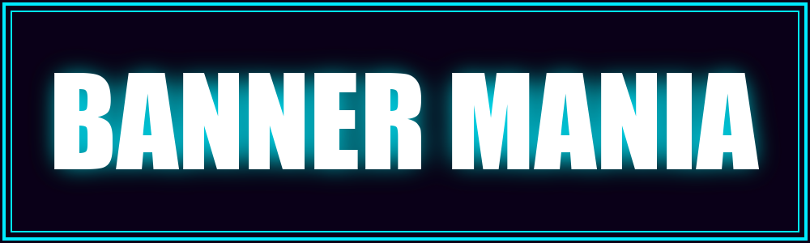
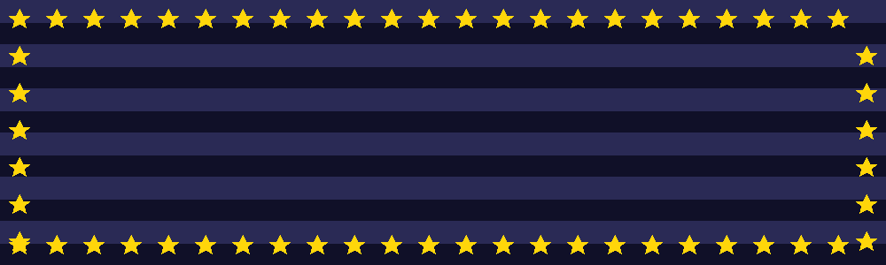
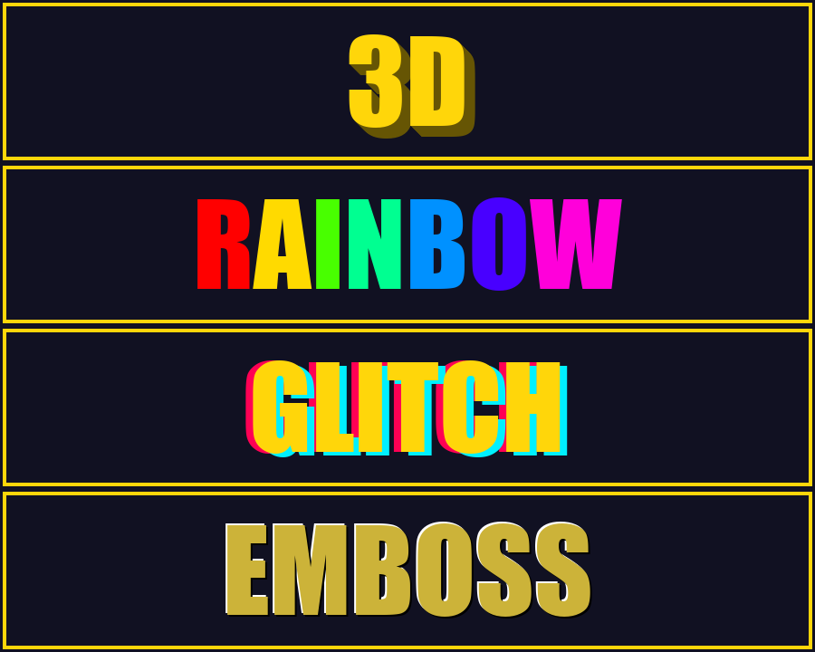
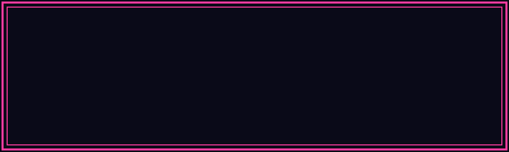

<div align="center">

# BannerMania 🎪

**A tiny retro banner generator, inspired by the classic 1989 [BannerMania](https://en.wikipedia.org/wiki/BannerMania).**

Type some text, pick a font, colors, a pattern, an effect, and a decorative
border — then download a **PNG**, or flip on marquee mode for a scrolling
**animated GIF** with per-letter wave/bounce motion and hue cycling.






</div>

---

## Contents

- [Features](#features)
- [Quick start](#quick-start)
- [Using the app](#using-the-app)
- [HTTP API](#http-api)
- [How it works](#how-it-works)
- [Development](#development)
- [Project layout](#project-layout)
- [License](#license)

---

## Features

| | |
|---|---|
| 🔤 **16 fonts** | Impact, Arial Black, Arial Rounded, Comic Sans, Chalkduster, Chalkboard, Noteworthy, Papyrus, Courier, Menlo, Monaco, Georgia, Futura, Avenir, Helvetica Neue, Geneva |
| ✨ **10 text effects** | `plain`, `outline`, `shadow`, `3d`, `gradient`, `rainbow`, `neon`, `glow`, `glitch`, `emboss` |
| 🎨 **5 background patterns** | `solid`, `stripes`, `checker`, `dots`, `diagonal` |
| 🖼️ **8 decorative borders** | `none`, `single`, `double`, `dashed`, `dotted`, `stars`, `zigzag`, `corners` |
| 🎞️ **Animated marquee** | Looping scrolling GIF with three motion modes — `scroll`, `wave`, `bounce` — and adjustable speed |
| 🌈 **Color cycle** | Optional hue rotation over the loop; composes with any effect and motion |
| 🎛️ **Full color control** | Two text colors + background + pattern accent, all customizable |
| 📐 **4 sizes** | Web banner, social, wide header, square — plus a 🎲 "Surprise me" randomizer |
| ⬇️ **One-click download** | PNG for static, GIF for marquee |

Text is auto-sized to fit: static banners fit to width; the marquee fits to
height so long text stays large and scrolls.

### Effects at a glance



### Color cycle



---

## Quick start

Requires **Python 3.9+**.

```bash
cd "AWS Community Builder/demo"
python3 -m venv .venv && source .venv/bin/activate
pip install -r requirements.txt
python app.py
```

Open **http://127.0.0.1:5001** and start making banners.

CLI flags:

```bash
python app.py --host 127.0.0.1 --port 5001 --debug
```

---

## Using the app

1. Type your **text**.
2. Pick a **font**, **effect**, **background pattern**, and **border**.
3. Tune the four **colors** (text, second text color for gradients, background,
   pattern accent).
4. Choose a **size**, or hit **🎲 Surprise me** for a random combination.
5. Tick **🎞️ Animate** to switch to a scrolling GIF — then choose a **motion**
   mode, a **scroll speed**, and optionally **🌈 Color cycle**.
6. Click **⬇ Download** to save the PNG (or GIF).

The preview updates live as you edit — under the hood it just points an ``
at the API described below.

---

## HTTP API

| Endpoint | Returns | Description |
|---|---|---|
| `GET /` | HTML | The web UI |
| `GET /generate` | `image/png` | A static banner |
| `GET /generate.gif` | `image/gif` | An animated scrolling marquee |
| `GET /health` | JSON | Available fonts, effects, patterns, borders, motions |

### Common parameters

Accepted by both `/generate` and `/generate.gif`:

| Param | Meaning | Default |
|---|---|---|
| `text` | Banner text | `BANNER MANIA` |
| `font` | Font name (see list above) | `Impact` |
| `effect` | Text effect | `shadow` |
| `pattern` | Background pattern | `solid` |
| `border` | Decorative border | `single` |
| `fg` | Text color (hex) | `#ffd60a` |
| `fg2` | Second text color, used by `gradient` | `#ff4747` |
| `bg` | Background color | `#111122` |
| `accent` | Pattern accent color | `#28284a` |
| `width` / `height` | Banner size in px (clamped) | `1000` / `300` |
| `download` | `1` forces a file download | — |

### Marquee-only parameters (`/generate.gif`)

| Param | Meaning | Default |
|---|---|---|
| `motion` | `scroll`, `wave`, or `bounce` | `scroll` |
| `cycle` | `1` rotates the text hue over the loop | off |
| `cycle_turns` | Hue turns completed per loop | `1.0` |
| `speed` | Milliseconds per frame (lower = faster) | `60` |
| `frames` | Frames in the loop (12–120) | `48` |

### Examples

```bash
# Static neon banner with a double border
curl "http://127.0.0.1:5001/generate?text=NEON+NIGHTS&effect=neon&border=double&fg=%2300eaff&bg=%230a0018" -o banner.png

# Scrolling rainbow marquee with a star border
curl "http://127.0.0.1:5001/generate.gif?text=AWS+Community+Builder&effect=rainbow&pattern=stripes&border=stars&speed=55" -o banner.gif

# Per-letter wave marquee
curl "http://127.0.0.1:5001/generate.gif?text=WAVE+RIDER&effect=rainbow&motion=wave&border=dotted&speed=55" -o wave.gif

# Color-cycling 3D marquee
curl "http://127.0.0.1:5001/generate.gif?text=COLOR+CYCLE&effect=3d&cycle=1&border=double&fg=%23ff3ca0&speed=55" -o cycle.gif
```

---

## How it works

BannerMania is a single Flask module (`app.py`) that renders everything with
Pillow — no client-side canvas, no build step.

- **Static banners** (`/generate`) — paint the background pattern, auto-fit the
  font to the box, then draw the text with its structural effect and border.
- **Marquee GIFs** (`/generate.gif`) —
  - In `scroll` mode the word is drawn **once** onto a wide transparent layer,
    and a banner-sized window slides across it frame by frame over a static
    background (cheap: one text render, N composites).
  - In `wave` / `bounce` mode each glyph is rendered onto **its own tile** and
    composited per frame at its scrolled x plus a vertical offset — so any
    effect (neon glow, 3D, glitch…) still works per letter.
  - The vertical phase completes whole cycles over the frame count, so the
    animation **loops seamlessly**.
  - All frames share **one palette** to avoid color flicker. With **color
    cycle** on, the text is re-rendered per frame with a rotated hue and the
    palette is built from a **montage of sampled frames**, so the full hue range
    survives GIF's 256-color quantization.

Fonts are resolved from macOS system paths with Linux `msttcorefonts` fallbacks;
only fonts actually present on the host are offered. If none are found, Pillow's
built-in bitmap font is used so the app still runs everywhere (it just won't
scale the text).

---

## Development

```bash
source .venv/bin/activate
python app.py --debug          # auto-reload on changes
curl -s http://127.0.0.1:5001/health | python -m json.tool
```

- The front end debounces edits a little longer in marquee mode, since a GIF is
  dozens of renders.
- Sizes and frame counts are clamped server-side.

> **Security note:** the server binds to `127.0.0.1` (local only) and the render
> endpoints take unauthenticated query params — fine for local/demo use. Before
> exposing it publicly, add input caps and rate limiting, since every request
> does image work.

---

## Project layout

```
demo/
├── app.py                # Flask backend + Pillow renderer
├── templates/
│   └── index.html        # retro web UI
├── static/
│   ├── style.css         # 80s CRT styling
│   └── app.js            # live preview, animate toggle, randomizer, download
├── docs/                 # README demo assets
├── requirements.txt      # Flask + Pillow
├── LICENSE               # Apache 2.0
└── README.md
```

---

## License

Licensed under the **Apache License 2.0** — see [`LICENSE`](LICENSE).

Built for **AWS Community Day Bolivia 2026** as a small, self-contained demo.
"BannerMania" is a nod to the 1989 Broderbund classic; this project is an
independent homage, not affiliated with it.
